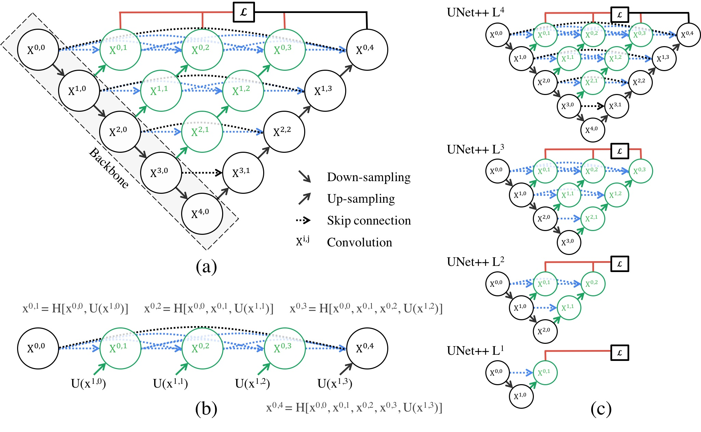
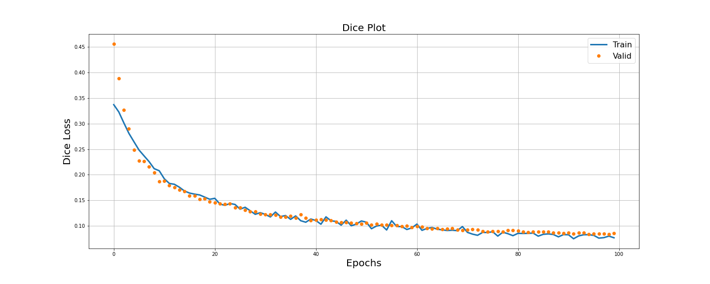
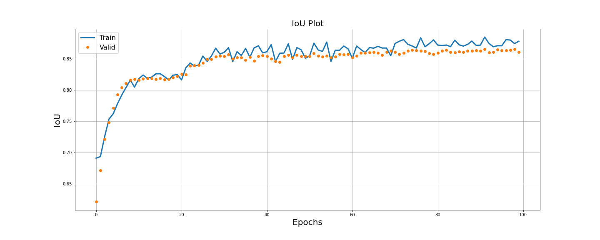
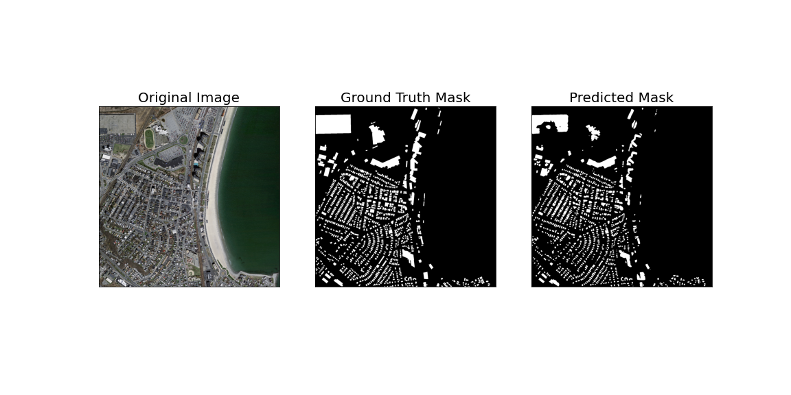
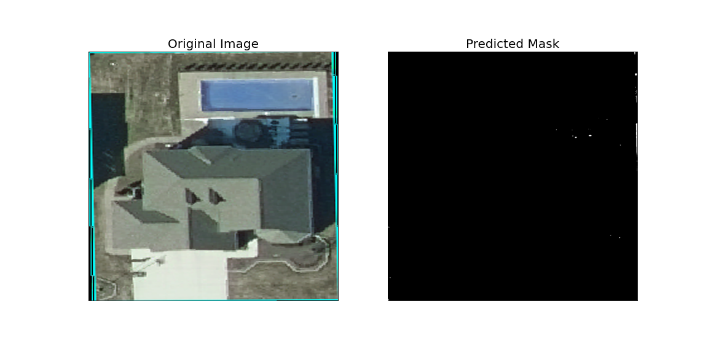
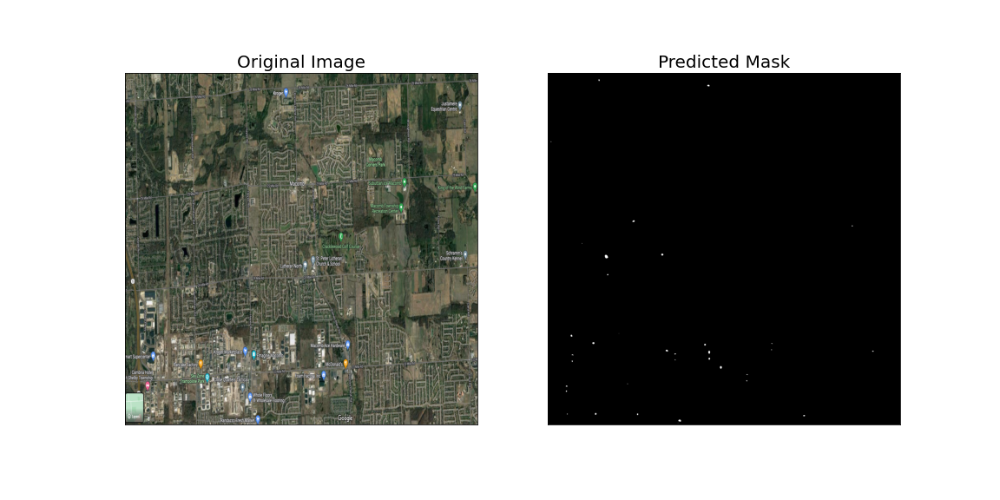
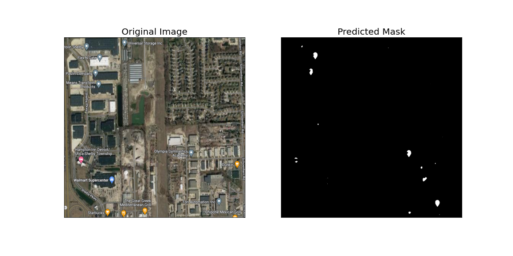
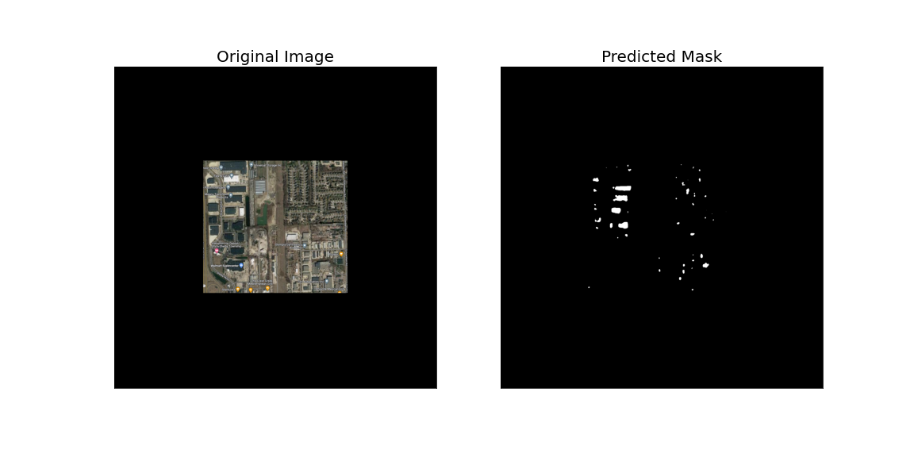

<h1>
Application of Unet++ in Aerial Imagery
</h1>
<h2>
Adrian Sandoval-Vargas
</h2>
<h3>
CSI 5140
</h3>

**Abstract**: This project aims to explore the application flexibility of Unet++ to other domains in computer vision and view some it's pit falls. Most computer vision Deep learning models are evaluated in IoU and Dice metrics that provide an adequate unit of grading for reconstructed masks. Although a model can perform extremely well with the training dataset, they can often fail to generate efficient masks using images that are in the same domain but vary in depth. This paper shows that having zoomed out/in images will have major effects on the model's performance.

## 1. Model

### 1.1 Unet++

Unet++ is a proceding architecture improving upon Unet by applying a Deep Surpervision block to the layers to prune off layers and increase adaptibility. The model's architecture is show in figure 1.

</img>
 Fig 1. Unet++ Architecture.

### 1.2 Unet++ Hyperparameters

For this project Unet++ was trained using *resnet34* and the encoder with pretrained encoder weights from *imagenet*. The activation function used was *sigmoid*. The model ran for *100 epochs* with the *DiceLoss* function and a *IoU threshold* of *0.5*. The optimizer bused was *Adam* with learning rate of *0.0001*. This model was implemented by Pavel Yakubovskiy [2].

## 2. Image Dataset

The dataset used for this project was the Massachusetts Buildings Dataset. This dataset contains 151 high resolution satellite images split into 137 train, 10 test, and 4 validation images. Similarly split are the ground truth labels associated with the images making a total of 302 images.

## 3. Model Performance

The model in general did well with the amount of data and how long it ran for. It ended with an training IoU score of *87.78* and Dice Loss of *0.0767*. For the validation set it ended up with *86.04* and *0.0853*, respectively.

</img>
 Fig 2. Unet++ Dice Loss.

</img>
 Fig 3. Unet++ IoU Score.

</img>
 Fig 4. Sample mask of Unet++ test image.

As we can see it does a fairly good job but lacks a bit on some buildings.

## 4. Experiments

In this section we will explore the effects of zooming in and out into satelite images and a modern noisey image. It is known that Deep Learning models are vulnerable to manipulated images. The questions is how will it perform with images in the same domain just zoomed in or zoomed out.

### 4.1 Zoomed in images

For the first experiment an aerial image of a house was taken and scaled up to meet the high resolution dimensions.

</img>
 Fig 5. Aerial home image.

As we can see in figure 5, there is little to no significant objects in the mask.

### 4.2 Zoomed out images

The second experiment was similar to the first where the image was just zoomed out to hardly recognize buildings.

</img>
 Fig 6. Aerial home image.

Similarly to experiment 4.1, there is little detection but this time the mask makes a bit more sense as its smaller globs.

### 4.3 Noisey images

#### 4.3.1 Scaled image
For the final experiment conducted an image was subjected to modern places of interest annotations on google maps. For the first of the two test coducted this is experiment the image was scaled up to meet original data scales. The result is rather odd as it only detect the annotations but not the buildings.

</img>
Fig 7. Noisey image scaled.

#### 4.3.2 Non-scaled image
For the latter experiment, the image was not scaled up to the original dataset's dimensions. The result of this image even with noise out performs experiment 4.3.1. 

</img>
Fig 8. Noisey image not scaled.

## 5. Conclusion

This project seconded the fact that images being used in any deep learning model must adhere to nearly the same standard as the original data. As shown in the experiments images that are too zoomed in/out will have a major impact on the model. This project also showed that although an image is scaled to the proper dimensions, if the quality in the original image is good then there is no need to scale as it would add more noise causing it to perform worse. The project finally shows that computer vision is a difficult subject as there are many variables that will impact the predictions. 

## 6. References

[1] Zongwei Zhou, Md Mahfuzur Rahman Siddiquee, Nima Tajbakhsh, and Jianming Liang, *Unet++ A Nested U-Net Architecture for Medical Image Segmentation* *arXiv:1807.10165v1* 18 Jul, 2018.

[2] Library containing models: [Segmentation Models Pytorch](https://github.com/qubvel/segmentation_models.pytorch)

[3] Dataset used [Massachusetts Buildings Dataset](https://www.kaggle.com/datasets/balraj98/massachusetts-buildings-dataset)

## 7. Code
The code for this project can be found [here on github](https://github.com/Adsanvar/Aerial_Unetplusplus). 

The gradio app is located in [Hugging Face](https://huggingface.co/spaces/Tlaloc/Aerial_Unet)

## 8. Acknowledements
Special thanks to: [KARTIK MISHRA](https://www.kaggle.com/code/kidoen/segmentationmodel) as his implementation helped debug my implementation.